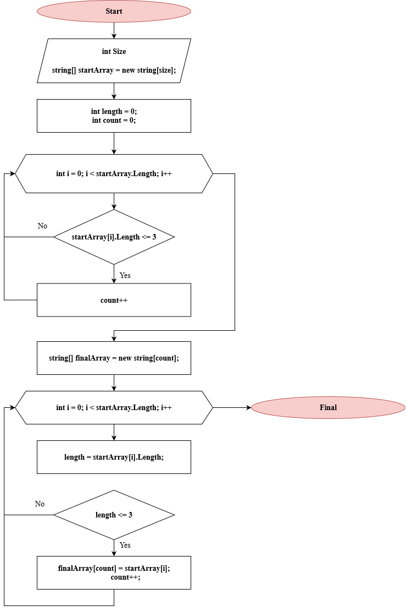

Итоговая проверочная работа "Выбор специализации".
------------------------------------------------------------------

**Задачи итоговой работы:**
1. Создать репозиторий на GitHub;
2. Нарисовать блок-схему алгоритма;
3. Дополнить репозиторий описанием работы в файле README.md;
4. Написать программу;
5. Использовать контроль версий в работе.

**Задача программы:**

Написать программу, которая из имеющегося массива строк, формирует массив из строк, длина которых меньше либо равна 3 символа. 
>Примеры:
>
>>* ["hello", "2", "world', ":-)"] -> ["2", ":-)"]
>
>>* ["1234", "1567", "-2", "computer science"] -> ["-2"]
>
>>* ["Russia", "Denmark", "Kazan"] -> []

**Алгоритм решения программы:**

Пользователь с консоли вводит количество элементов массива и с консоли заполняеет массив. Далее, пишем метод, в котором создаем новый массив, и с помощью алгоритма проверки на заданное условие, копируем удовлетворяющие наши требования элементы, в новый массив.

**Блок-схема алгоритма:**

